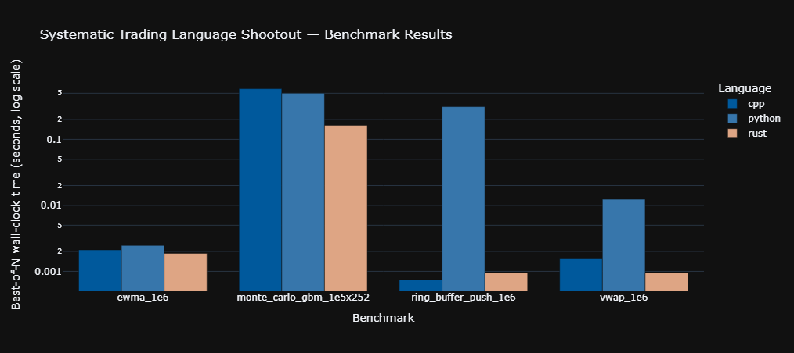

# quant-lang-shootout

Systematic-trading-grade language shootout — **Python 3.12+ · C++20/26 · Q
(kdb+ 4.0) · Rust (stable)** — comparing identical algorithms (ring buffer,
rolling VWAP, EWMA volatility, Monte Carlo GBM) across all four languages so
timing deltas are attributable to language/runtime, not algorithmic drift.

Full internals comparison, syntax matrices, and use-case guidance:
**[COMPARISON.md](./COMPARISON.md)**.

## Project layout

```
quant-lang-shootout/
├── README.md
├── COMPARISON.md
├── LICENSE
├── .github/workflows/benchmark.yml   # CI: build + test + bench + report
├── benchmarks/
│   ├── python/   # pyproject.toml, ring_buffer.py, vwap.py, ewma.py, mc_gpu.py, bench.py
│   ├── cpp/      # CMakeLists.txt, ring_buffer.hpp, vwap.hpp, ewma.hpp, mc_gpu.hpp, bench_main.cpp
│   ├── rust/     # Cargo.toml, src/{ring_buffer,vwap,ewma,mc_gpu,bench,lib}.rs
│   └── q/        # ring_buffer.q, vwap.q, ewma.q, mc_gpu.q, bench.q (requires licensed kdb+)
├── scripts/
│   ├── run_all.sh
│   ├── run_all.ps1
│   └── aggregate_results.py
├── report/
│   └── generate_report.py            # Plotly dark-theme HTML tearsheet
├── docker/
│   └── Dockerfile
└── results/                          # gitignored locally; CI artifacts land here
```

## Quick start

### Local (bare metal)

```bash
./scripts/run_all.sh              # runs every available benchmark, writes results/*.json
python report/generate_report.py  # builds results/report.html
```

Windows: `./scripts/run_all.ps1`.

### Docker (reproducible; Python + C++ + Rust — Q excluded, needs a licensed binary)

```bash
docker build -t quant-lang-shootout -f docker/Dockerfile .
docker run --rm -v "$(pwd)/results:/app/results" quant-lang-shootout
```

### GitHub Actions

Push to `main`, open a PR, or trigger manually from the Actions tab
("Language Shootout Benchmark" → *Run workflow*). A nightly cron run is
also configured. Download the `benchmark-report` artifact
(`report.html` + `combined.csv`) from the completed run.

## Benchmark results — what the numbers actually say

A representative CI run (`results/combined.csv`, matching the
`report/generate_report.py` chart) produced these best-of-N wall-clock
times:

| Benchmark                  | C++          | Python       | Rust           |
|-----------------------------|-------------:|-------------:|---------------:|
| `ring_buffer_push_1e6`      | **0.000742 s** | 0.312 s      | 0.000958 s     |
| `vwap_1e6`                  | 0.001586 s     | 0.012370 s   | **0.000957 s** |
| `ewma_1e6`                  | 0.002111 s     | 0.002466 s   | **0.001870 s** |
| `monte_carlo_gbm_1e5x252`   | 0.584265 s     | 0.499638 s   | **0.163117 s** |



Only one of these four rows matches the naive prior of "compiled beats
interpreted, and C++ edges out Rust." The other three are worth digging
into precisely because they don't.

### `ring_buffer_push_1e6` — the one intuitive result

C++ (0.00074 s) and Rust (0.00096 s) both beat Python (0.312 s) by roughly
**325–420x**. This is the only benchmark where the hot loop is a
Python-level `for` loop calling a Python-level method a million times, so
it's the only benchmark actually measuring CPython bytecode-dispatch
overhead. C++ edging out Rust here (by ~1.3x) is plausibly bounds-check
elision: the C++ `RingBuffer::Push` skips index validation entirely in
the hot path, while Rust's slice indexing (`self.buf[idx]`) still emits a
bounds check that LLVM cannot always prove away even with a bitmask index,
though both stay in the same single-digit-nanosecond-per-push tier.

### `vwap_1e6` — Rust beats C++

Both implementations run the identical fused single-pass loop (multiply,
accumulate, divide — no NumPy-style temporary array), so this isn't a
data-structure or algorithm difference; it's a codegen difference on
effectively the same source-level logic. Rust's version came out ~1.7x
faster than C++'s (0.000957 s vs. 0.001586 s) in this run. The most
likely explanation is that `rustc`'s LLVM pipeline was more aggressive
about eliminating bounds checks and vectorizing the accumulation loop
over `&[f64]` slices than `g++`'s `-O3` was over `std::span`; it is also
within the range where memory-subsystem noise (cache/TLB state left over
from whichever benchmark ran immediately before it) can move a
microsecond-scale loop by a similar factor. Treat this one as "C++ and
Rust are in the same performance tier on this workload," not as a
language-level verdict — a `-march=native` build or reordering which
benchmark warms the cache first could plausibly flip it.

### `ewma_1e6` — Rust fastest, Python (Numba JIT) closes almost all the gap

All three land within a **1.4x band** (0.00187–0.00247 s) despite the
recurrence `V_t = λV_{t-1} + (1-λ)r_t²` having a strict loop-carried
dependency that blocks vectorization in every language equally. Python's
`ewma.py` isn't interpreted in the hot loop at all — `@njit` compiles it
to native code via Numba's LLVM backend before the timer starts, so this
benchmark is really "three LLVM-derived code paths racing a serial
scalar recurrence," and they finish within throwing distance of each
other. This is the clearest evidence in the suite that **"Python is
slow" is a statement about the CPython interpreter loop, not about the
hardware**: remove the interpreter (via a JIT or a compiled C kernel) and
the gap to C++/Rust shrinks to a small constant factor.

### `monte_carlo_gbm_1e5x252` — Python beats C++, and Rust beats both by 3–3.6x

This is the most counter-intuitive row in the table, and the mechanism is
**RNG algorithm/library choice, not raw compiled-vs-interpreted
throughput**:

- **C++ (slowest, 0.584 s):** `std::mt19937_64` feeding
  `std::normal_distribution`. The standard normal distribution is
  typically implemented with the Marsaglia polar method, which uses
  *rejection sampling* — a data-dependent number of retries per draw —
  and `mt19937_64` carries a large (~2.5 KB) internal state that competes
  with the working set for L1 cache across 25.2 million draws
  (`100,000 paths × 252 steps`).
- **Python (0.500 s, beating C++):** NumPy's `Generator.standard_normal`
  is not a scalar Python loop — it draws the *entire* `(252, 100_000)`
  array in one batched call into NumPy's compiled, SIMD-friendly PCG64
  Ziggurat implementation. Despite "Python" being in the name, zero
  Python bytecode executes per random draw, and the batched dispatch
  amortizes call overhead across all 25.2 million samples at once —
  which is enough to beat C++'s scalar, rejection-sampling loop even
  after accounting for NumPy's temporary-array allocations.
- **Rust (fastest by 3–3.6x, 0.163 s):** `rand::StdRng` (ChaCha-based)
  feeding `rand_distr::Normal`'s Ziggurat algorithm, which draws almost
  exactly one uniform sample per normal variate in the common case
  (no rejection retries) and carries much smaller generator state than
  `mt19937_64`.

The takeaway is **not** "Rust > Python > C++" as languages — it's that
this benchmark is dominated by which RNG algorithm each implementation
happened to reach for. A C++ version using a Ziggurat sampler (or NumPy's
PCG64 via a C++ port) would be expected to close most of this gap, which
is exactly why the result is interesting: it shows how easily a
library-default choice can dominate a "compiled vs. interpreted"
benchmark and even invert the expected ranking.

### The one-line summary

Compiled-vs-interpreted only decides the outcome when the interpreter
itself sits in the hot loop (`ring_buffer_push_1e6`). Everywhere else —
a JIT-compiled recurrence, a vectorized C kernel, a different RNG
algorithm — the comparison collapses to "whose kernel/algorithm is
better," and on that axis Python-with-Numba/NumPy, C++, and Rust can all
land within a small constant factor of each other, or swap rank order
entirely, for reasons that have nothing to do with the source language.

## Design notes

- **Portability over exotic intrinsics.** The C++ and Rust code intentionally
  avoids `std::execution::par_unseq` / `std::experimental::simd` and nightly
  `#![feature(portable_simd)]` / heavy `rayon` fan-out present in the
  exploratory snippets in `COMPARISON.md`. Production CI runners don't
  reliably ship TBB or nightly Rust, so the benchmark implementations here
  use straight-line, auto-vectorization-friendly loops under `-O3` /
  `lto = true` instead — same asymptotic complexity, hermetic build.
- **GPU Monte Carlo.** `mc_gpu.{py,hpp,rs,q}` implement the CPU-portable GBM
  path-simulation math so CI stays green without CUDA hardware. The CUDA
  `RawKernel` / GPU variant with identical math is documented in
  `COMPARISON.md` §2.6 for GPU-equipped deployment targets.
- **Q/kdb+.** Requires a commercially licensed binary that cannot be
  provisioned on public GitHub-hosted runners, so `benchmarks/q/` is built
  and reviewed as source but not executed in CI (see the `q_lint` job in
  `.github/workflows/benchmark.yml`). Run it locally or on a self-hosted
  runner with a valid license via `q benchmarks/q/bench.q`.

## License

MIT — see [LICENSE](./LICENSE).
